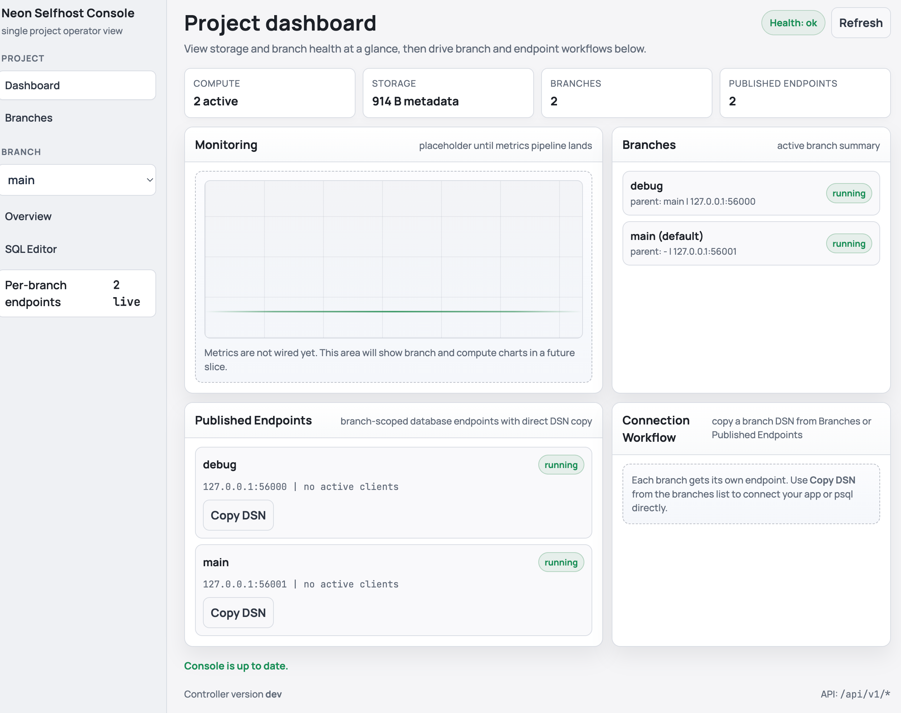
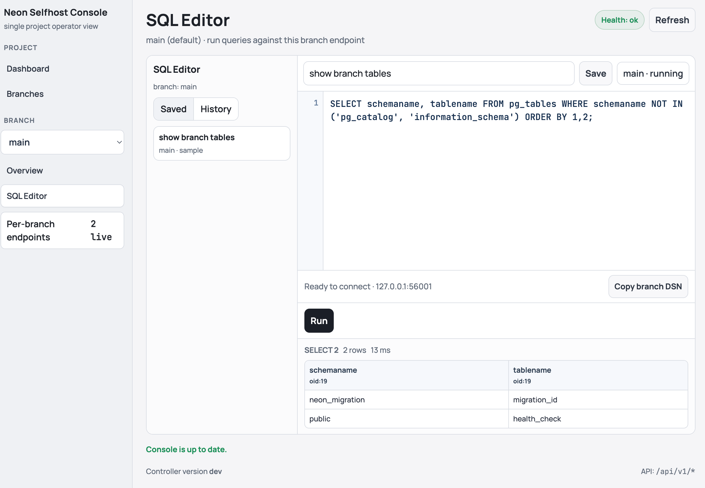

# neon-selfhost

`neon-selfhost` is a Docker-first control plane and web console for running open-source Neon locally.

If you are new to Neon: think of it as PostgreSQL with branchable timelines, so you can spin up safe copies of data for testing, migrations, and rollback drills without cloning full environments.

Status: pre-alpha. The core branch-first flow works in Docker mode (branch management, branch endpoint publish, branch overview, restore, and branch-scoped SQL execution), but this is still experimental and not production-ready.

## What This Is

- A lightweight admin layer over self-hosted Neon components.
- A branch-first workflow for local/small-team environments.
- A safety-oriented tool for app upgrade rehearsals and quick rollback validation.

## Features (Current)

- Web console at `/` with Dashboard, Branches, Branch overview, and SQL Editor pages.
- Branch lifecycle APIs: list/create/reset/delete (soft-delete).
- Branch endpoint APIs: publish/unpublish/list/connection, with auto-publish defaults in Docker mode.
- Branch-scoped SQL execution API and UI integration (single statement, read-only defaults, bounded result sizes/timeouts).
- Timestamp-based restore API (`POST /api/v1/restore`) backed by pageserver timestamp-to-LSN resolution.
- Operator basics: HTTP basic auth, branch-state persistence, health/status endpoints, and operation log API.

## Console Preview

### Dashboard



### SQL Editor



## What This Is Not

- A full replacement for the managed `neon.com` platform.
- A multi-tenant cloud control plane.
- A fully hardened production database platform.

## Current Scaffold

- `cmd/controller` contains the Go controller entrypoint.
- `internal/config` contains environment-based config loading, including basic auth credentials.
- `internal/branch` contains the single-tenant branch model/store with optional on-disk persistence.
- `internal/server` contains the HTTP router, web console UI (`GET /`), status/health endpoints, branch and restore endpoints, endpoint lifecycle endpoints, SQL execution endpoint, and operation log endpoint for MVP slice 1.
- `docker-compose.yml` wires controller + storage broker/pageserver/safekeepers/compute under the `neon` profile.
- `configs/neon/pageserver` contains the pageserver config mounted into the Neon container runtime.
- `configs/neon/compute_wrapper` contains the compute wrapper image/build files used by compose for local compute startup.
- `Dockerfile.controller` builds a minimal controller image.

## Implemented API (MVP Slice 1)

- `GET /api/v1/status`
- `GET /api/v1/health`
- `GET /api/v1/branches`
- `POST /api/v1/branches`
- `POST /api/v1/branches/{name}/reset`
- `POST /api/v1/branches/{name}/publish`
- `POST /api/v1/branches/{name}/unpublish`
- `GET /api/v1/branches/{name}/connection`
- `POST /api/v1/branches/{name}/sql/execute`
- `DELETE /api/v1/branches/{name}` (soft-delete)
- `POST /api/v1/restore`
- `POST /api/v1/endpoints/primary/start`
- `POST /api/v1/endpoints/primary/stop`
- `POST /api/v1/endpoints/primary/switch`
- `GET /api/v1/endpoints/primary/connection`
- `GET /api/v1/endpoints` (published branch endpoints)
- `GET /api/v1/operations`

When `BASIC_AUTH_USER` and `BASIC_AUTH_PASSWORD` are set, both the web console and API routes require HTTP basic auth.

For safety, binding the controller to a non-loopback `HTTP_HOST` now requires basic auth by default. You can bypass this only by explicitly setting `ALLOW_INSECURE_HTTP_BIND=1` (intended for local testing only).

When `CONTROLLER_DATA_DIR` is set, branch state persists in SQLite (`controller.db` under `CONTROLLER_DATA_DIR`). On first startup with SQLite, legacy `branches.json` state is imported when present.

Operation history (`GET /api/v1/operations`) is persisted in SQLite (`controller.db` under `CONTROLLER_DATA_DIR`) and reloaded on startup. If a legacy `operations.jsonl` file exists and the SQLite operations table is empty, entries are imported once. Interrupted in-flight operations are marked failed after restart.

Quick backup/export example for the controller database:

```bash
sqlite3 "${CONTROLLER_DATA_DIR}/controller.db" ".backup '${CONTROLLER_DATA_DIR}/controller-$(date +%Y%m%d-%H%M%S).db'"
```

`POST /api/v1/restore` now resolves timestamp-to-LSN via pageserver APIs, creates restore timelines at the resolved LSN, and persists the new branch attachment metadata.

Restore now fails closed with `restore_unavailable` when pageserver-backed restore integration is not configured.

Primary endpoint start/stop/switch and connection APIs orchestrate the compose `compute` container lifecycle through the Docker socket. Start/switch resolve branch attachment metadata (tenant/timeline) via pageserver APIs, persist endpoint selection under `COMPUTE_DATA_DIR`, and restart compute against that selection.

Endpoint switch still branches from the selected parent timeline head, while restore creates a new timeline anchored at the resolved timestamp LSN.

`GET /api/v1/endpoints/primary/connection` includes runtime readiness diagnostics (`ready`, `runtime_state`, `runtime_message`), reports `status=starting` while runtime health checks are warming up, and reports `status=unhealthy` when runtime is running but unhealthy.

Connection `dsn` is returned only when `ready=true`.

The web console now uses branch-first flows: branch selection in the left sidebar drives the Branch overview and SQL Editor pages, and connection helpers are branch-scoped.

SQL execution is read-only by default, with optional write mode when `allow_writes=true` is passed to `POST /api/v1/branches/{name}/sql/execute` (the SQL Editor exposes this as an explicit "Enable write queries" toggle).

Branch credentials are controller-managed and branch-specific: newly created and restored branches receive random passwords, and the active branch password is surfaced in connection helpers and `GET /api/v1/endpoints/primary/connection`.

Published branch endpoints are Docker-mode only: active branches are auto-published on startup, and newly created/restored branches are auto-published by default. `POST /api/v1/branches/{name}/publish` still supports explicit publish and allocates a host port from a configured range, starts a lightweight TCP listener in the controller, and lazily starts branch compute on first client connection. Published branch compute containers now support idle auto-stop (`BRANCH_ENDPOINT_IDLE_TIMEOUT`, default `10m`) while keeping listeners published for lazy restart on the next connection. Each branch endpoint listener also enforces a per-branch active-connection cap (`BRANCH_ENDPOINT_MAX_CONNECTIONS`, default `32`) to protect the controller. `POST /api/v1/branches/{name}/unpublish` tears down the listener and branch compute container. `GET /api/v1/endpoints` lists currently published branch endpoints.

Branch reset (`POST /api/v1/branches/{name}/reset`) refreshes published branch endpoint attachment metadata in addition to primary-endpoint metadata. Branch delete now unpublishes branch endpoint state before soft-delete.

Branch mutation and restore APIs return `storage_error` responses when controller state persistence fails (including disk-full conditions).

Controller startup runs a preflight check for `CONTROLLER_DATA_DIR` writability and exits early on invalid paths.

Validation and JSON parsing failures return stable JSON error envelopes:

```json
{
  "error": {
    "code": "validation_error",
    "message": "branch name is required"
  }
}
```

Oversized JSON request bodies return `request_too_large` (`413`): most write/control routes cap request bodies at 1 MiB, and `POST /api/v1/branches/{name}/sql/execute` uses a tighter 128 KiB cap.

## Quickstart (Full Local Stack)

```bash
BASIC_AUTH_PASSWORD=change-me mise run stack:up
mise run stack:ps
```

Then open `http://127.0.0.1:8080/` and sign in with:

- user: `admin`
- password: `change-me`

This starts a usable controller + Neon storage/compute stack immediately.

To stop the stack:

```bash
mise run stack:down
```

## Quickstart (Controller Dev Only)

```bash
mise exec -- go test ./...
mise exec -- go run ./cmd/controller
```

Then open `http://127.0.0.1:8080/`.

To run with basic auth enabled:

```bash
BASIC_AUTH_USER=admin BASIC_AUTH_PASSWORD=change-me mise exec -- go run ./cmd/controller
curl -u admin:change-me http://127.0.0.1:8080/api/v1/status
```

To bring up the controller plus Neon storage/compute services without mise tasks, set `BASIC_AUTH_PASSWORD` and run:

```bash
BASIC_AUTH_PASSWORD=change-me docker compose --profile neon up
```

Or use mise tasks:

```bash
mise run stack:up
mise run stack:ps
```

Override `NEON_IMAGE`, `NEON_COMPUTE_IMAGE`, or `NEON_COMPUTE_TAG` if you need specific image tags.
The compose controller runs with `PRIMARY_ENDPOINT_MODE=docker`, uses `/var/run/docker.sock` to orchestrate primary and branch compute lifecycle, and uses `PAGESERVER_API` to resolve branch attachment metadata.
Use `PRIMARY_ENDPOINT_PASSWORD` if endpoint credentials differ from the default `cloud_admin` value.

Compose also exposes a localhost branch endpoint range (`56000-56049` by default). Tune this via `BRANCH_ENDPOINT_BIND_HOST`, `BRANCH_ENDPOINT_PORT_START`, and `BRANCH_ENDPOINT_PORT_END`.

## Smoke Testing

Run the API smoke test against an already-running stack:

```bash
mise run smoke
```

Run smoke test with automatic stack start/stop for a clean run:

```bash
mise run smoke:fresh
```

The smoke test script lives at `scripts/smoke.sh` and validates status/health, branch create/switch/delete, restore, and operation-log behavior.

## Branch Data Reset + Isolation Verification

Reset a known test dataset on `main` (database `branch_lab`) for manual UI/API branching checks:

```bash
mise run db:reset-seed
```

Run reset/seed plus automated branch-isolation verification (mutate on a temporary branch, confirm `main` is unchanged):

```bash
mise run db:verify
```

Run the same verification with automatic stack start/stop:

```bash
mise run db:verify:fresh
```

The backing script is `scripts/reset_seed_data.sh`.
By default the script uses the active branch password returned by `GET /api/v1/endpoints/primary/connection`; set `DB_PASSWORD` only to override that.
This workflow drops and recreates the target database; it refuses non-local `BASE_URL` by default unless you explicitly set `ALLOW_REMOTE_RESET=1` (or pass `--force` to the script).

### Seeded Test Dataset

`mise run db:reset-seed` (or `mise run db:verify*`) creates database `branch_lab` on `main` with:

- Schema: `app`
- Tables:
  - `app.accounts` (`id`, `slug`, `tier`, `created_at`)
  - `app.documents` (`id`, `account_id`, `title`, `body`, `created_at`)
- Seed rows:
  - `app.accounts`: `acme` (`pro`), `globex` (`starter`), `initech` (`enterprise`)
  - `app.documents`: 4 rows total (2 for `acme`, 1 for `globex`, 1 for `initech`)
- Default DB search path is set to `app, public` so `\d` and `\dt` in `psql` show the seeded tables directly.

### View Seed Data With psql

Connect to the seeded DB:

```bash
DB_PASSWORD=$(curl -sS -u admin:change-me http://127.0.0.1:8080/api/v1/endpoints/primary/connection | jq -r '.connection.password')
PGPASSWORD="$DB_PASSWORD" psql "postgresql://cloud_admin@127.0.0.1:55433/branch_lab?sslmode=disable"
```

Useful inspection queries:

```sql
\d
\dt

SELECT id, slug, tier, created_at
FROM app.accounts
ORDER BY id;

SELECT d.id, a.slug AS account, d.title, d.body, d.created_at
FROM app.documents d
JOIN app.accounts a ON a.id = d.account_id
ORDER BY d.id;

SELECT count(*) AS accounts FROM app.accounts;
SELECT count(*) AS documents FROM app.documents;
```

To verify branch isolation manually:

1. In the console sidebar, select a non-`main` branch (create one first if needed).
2. In SQL Editor for that branch, run a mutation (for example `DELETE FROM app.documents WHERE account_id = 1;`).
3. Switch the sidebar branch selector back to `main` and rerun counts; `main` should still show 3 accounts and 4 documents.

To stop everything:

```bash
mise run stack:down
```

## Operational Caveats (MVP)

- Single-node deployment is not HA. Host or disk loss can still cause data loss.
- Docker named volumes are not backups.
- Branching and PITR retention increase disk usage; in Phase 1, operations must fail safely with clear errors/logs, while proactive disk guardrails are planned for Phase 2.
- Soft-deleting a branch does not imply immediate disk reclamation.
- If exposing UI or Postgres beyond localhost, terminate TLS via a reverse proxy; basic auth alone is not Internet-grade protection.

## Repository Layout

- `AGENTS.md` - contribution and coding-agent rules.
- `configs/neon/pageserver` - pageserver runtime config used by `docker compose --profile neon`.
- `configs/neon/compute_wrapper` - compute wrapper build/runtime files used by `docker compose --profile neon`.
- `docs/architecture.md` - architecture, deployment topology, and safety model.
- `docs/mvp-roadmap.md` - phased plan for delivery.

## Current Status

Pre-alpha with working end-to-end local flows for branch lifecycle, branch endpoint publish/unpublish, timestamp restore, and branch-scoped SQL execution.

Expect rapid iteration, breaking changes, and incomplete hardening while the core snapshot/restore/switch model is refined.

See `docs/architecture.md` for the current target design.
