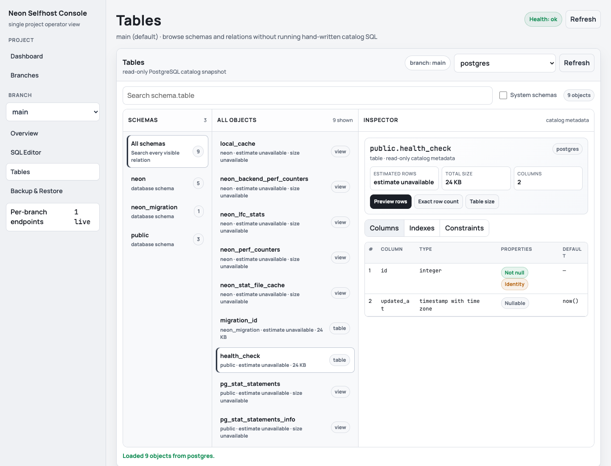

# neon-selfhost

`neon-selfhost` is a Podman-first control plane and web console for running open-source [Neon](https://neon.tech/) on a single host. It gives one operator a branch-first PostgreSQL workflow: create isolated timelines, publish per-branch endpoints, inspect schemas, run guarded SQL, and restore retained history into a new branch.

**Status:** experimental. The core workflows run end to end on the included Compose stack and are in use on a live single-node deployment. The project is still evolving and does not yet provide host-level high availability, automated off-host data backups, or production monitoring and disk-pressure automation.

## Console

### Project dashboard


### Tables



### SQL Editor


## Current Features

- Six console views: Dashboard, Branches, branch Overview, SQL Editor, Tables, and Backup & Restore.
- Branch lifecycle management with create, reset-from-parent, and soft-delete workflows backed by Neon timelines.
- Automatically published branch endpoints with controller-managed credentials, lazy compute startup, idle shutdown, and bounded connections.
- Point-in-time restore into a new branch using pageserver timestamp-to-LSN resolution. The source branch remains unchanged.
- Branch- and database-scoped SQL execution with a single-statement limit, read-only defaults, bounded results and timeouts, optional writes, and a second confirmation for writes to `main`.
- Persistent saved queries and execution history, filterable by the current database or across the project.
- Read-only schema browsing for tables, views, columns, indexes, constraints, row estimates, and relation sizes, with generated inspection queries handed to the SQL Editor.
- SQLite controller state for branches, endpoint publication, SQL library data, and operation history, including safe metadata backup and restore tooling.
- HTTP basic auth, structured operation logging, health and status APIs, startup preflight checks, and graceful shutdown.
- API controls for primary endpoint start, stop, and branch handoff, plus explicit branch endpoint publish and unpublish operations.

## Runtime Model

The supported deployment is a single-host, single-tenant Podman Compose stack containing:

- The Go controller and embedded web console.
- One pageserver and one safekeeper.
- One primary compute plus on-demand branch computes.
- Persistent controller, compute, pageserver, and safekeeper storage.
- Podman's Docker-compatible API socket for compute orchestration.

The controller, primary PostgreSQL endpoint, and published branch endpoint range bind to loopback by default. The tested setup uses rootful Podman; Docker-compatible sockets can be configured, but rootless Podman has not been validated.

## Quickstart

Requirements: [mise](https://mise.jdx.dev/), Podman, and Podman Compose.

```bash
PRIMARY_ENDPOINT_PASSWORD=replace-me \
BASIC_AUTH_PASSWORD=change-me \
mise run stack:up
```

Open <http://127.0.0.1:8080/> and sign in as `admin` with the configured basic-auth password.

```bash
mise run stack:ps
mise run stack:logs
mise run stack:down
```

For larger or durable datasets, use `docker-compose.storage.yml` to place all Neon state on a dedicated filesystem. See [Architecture](docs/architecture.md) for the storage topology and [Development](docs/development.md) for setup, testing, fixtures, API routes, and controller metadata recovery.

## Operational Notes

- A single host, safekeeper, and local filesystem do not provide high availability or disaster recovery. Back up Neon data off-host independently of the controller metadata backup tools.
- Soft-delete and reset can leave old timelines consuming storage indefinitely. Plan and verify explicit pageserver timeline cleanup rather than assuming controller actions reclaim disk space.
- Dashboard storage currently measures controller metadata, not database disk usage; the monitoring panel is a placeholder.
- Keep the controller and PostgreSQL ports on trusted networks. The controller has no built-in TLS, connection helpers use `sslmode=disable`, and access to its container-engine socket is equivalent to engine-level authority.
- Branch passwords are operational secrets stored in controller state and compute selection files and returned to authenticated connection helpers. Protect the controller data directory and backups accordingly.
- Pin Neon image versions and test upgrades before relying on a long-lived deployment; the Compose defaults currently track upstream image tags.

## Documentation

- [Architecture](docs/architecture.md): components, topology, data flow, and safety model.
- [Development](docs/development.md): local setup, tests, smoke workflows, fixtures, API inventory, and repository workflow.
- [MVP roadmap](docs/mvp-roadmap.md): implemented baseline and remaining hardening work.
- [Changelog](changelog.md): user-visible changes.
